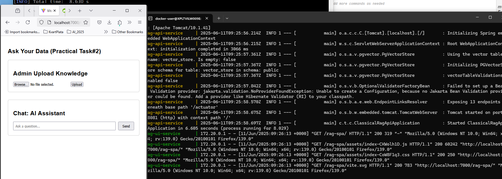

# Generative AI and Large Language Models

# Simple Retrieval-Augmented Generation (RAG) Web App

This project demonstrates a minimal **RAG system** using:

- **Backend (Spring Boot 3, Spring AI + Java 21)**:
    - Retriever Service: retrieves relevant knowledge from PostgreSQL + pgvector
    - Generator Service:  generate answers
    - Session-based ChatHistory
    - Memory window (only last 10 (not yet configured->hardcoded) messages kept)
    - [Swagger UI for easy API testing]()

- **Frontend (ReactJS + Vite)**:
    - Single-page chat app
    - Maintains sessionId (UUID) locally
    - Displays conversation between user and AI

---

## 🛠 Technologies Used
- **Backend**: Java 21, Spring Boot 3, Spring AI 1.0, PostgreSQL with extensions: [pgvector](https://github.com/pgvector/pgvector)
- **Frontend**: ReactJS (Vite)
- **Vector Search**: vector extension in PostgreSQL
- **Embeddings**: postgresML 
- **OpenAI**: For text generation via Spring Boot AI

---
## REST API Documentation
- Run application and find the OpenAPI descriptions at /v3/api-docs, which is the default path:

[api-docs](http://localhost:8081/v3/api-docs)
[swagger-ui](http://localhost:8081/swagger-ui/index.html)

## How to Run
### Prerequisites
- Java 21
- npm (to build UI) 
- Docker engine
- bash console
- Create `sb-projects` under `$HOME` <br/> 
```shell
cd ~
mkdir sb-projects
cd sb-projects
``` 
### Build docker images Locally (Optional)
**The following 2 repositories should be cloned under the same folder !!!** <br/>
- Clone [classical-rag-api](https://github.com/MarinaPimenova/classical-rag-api)
- Clone [rag-spa](https://github.com/MarinaPimenova/rag-spa) <br/> `git clone https://github.com/MarinaPimenova/rag-spa.git`
- Go to `k8s` subfolder under `classical-rag-api` folder and execute `./build-all-docker-image.sh` to build images

#### Push docker images to https://hub.docker.com/
Let’s build our container: <br/>
```shell
$ docker build -t mnpma/rag-ui:1.0 .
 
$ docker build -t mnpma/rag-api:1.0 .

```
Now let’s push this to Docker Hub. If you haven’t logged into the Docker Hub <br/>
via your command line, you must do this now, and enter your username and password: <br/>
```shell
$ docker login
Login with your Docker ID to push and pull images from Docker Hub. If you don't have a Docker ID, head over to https://hub.docker.com to create one.
Username:
Password:
Login Succeeded
$
$ docker push mnpma/rag-ui:1.0
$ docker push mnpma/rag-api:1.0
```

### Set up ENVIRONMENT variables & Run docker-compose
- Before running docker-compose you need set up the following Environment variables in the `.env` file under config folder:
  - POSTGRES_USER -> by default admin
  - POSTGRES_PASSWORD -> by default admin
  - OPEN_AI_API_KEY -> *No default value*
  - OPEN_AI_ENDPOINT -> by default https://ai-proxy.lab.epam.com
  - CHAT_MODEL -> by default `gpt-4.1-mini-2025-04-14` 
  - MISTRAL_AI_API_KEY -> *No default value* 
- Open a terminal, navigate to the directory (`<ROOT_FOLDER>/classical-rag-api/docker-config`) <br/>containing docker-compose.yml file, and run the following command:

```shell
cd <ROOT_FOLDER>/classical-rag-api/docker-config

docker-compose --env-file ./config/.env up
```

Frontend URL: http://localhost:7000/rag-spa


#### Run DB (standalone for debugging)
```shell
cd ~/sb-projects/classical-rag-api/docker-config
docker rm -v -f $(docker ps -qa)
docker rmi -f IMAGE_ID
docker-compose down -v --remove-orphans

docker-compose -f ./pgvector-docker-compose.yml --env-file ./config/.env up
```

### TBD
[PostgresML Embeddings](https://docs.spring.io/spring-ai/reference/api/embeddings/postgresml-embeddings.html)
[PostgresML](https://github.com/postgresml/postgresml/blob/master/README.md)
